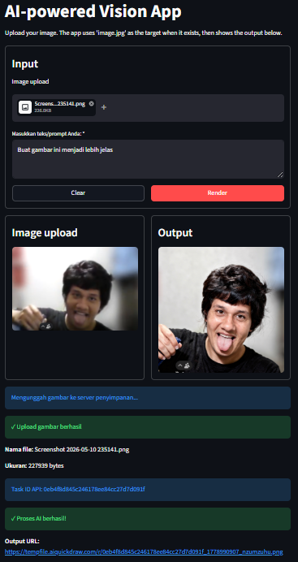

# AI-Powered Vision App

Aplikasi antarmuka web interaktif yang dibangun menggunakan **Streamlit** untuk berinteraksi dengan model _Artificial Intelligence_ (AI) pemrosesan gambar. Proyek ini merupakan bagian dari implementasi **Sistem Kecerdasan Visual Real-Time**, memungkinkan pengguna untuk mengunggah gambar, memberikan _prompt_ teks, dan menerima hasil manipulasi visual berbasis AI secara langsung.

## Fitur Utama

- **Image & Text Processing**: Mendukung pemrosesan _Image-to-Image_ (dengan file unggahan) maupun _Text-to-Image_ (hanya menggunakan prompt teks).
- **API Integration**: Terintegrasi langsung dengan endpoint AI eksternal (`kie.ai`) untuk inferensi model.
- **Real-Time Task Polling**: Sistem _polling_ otomatis untuk mengecek status pemrosesan gambar (sukses, gagal, atau _timeout_).
- **Secure Configuration**: Menggunakan sistem `secrets` lokal untuk mencegah kebocoran API Key.
- **State Management**: Tombol `Clear` yang berfungsi penuh untuk mereset seluruh _input_ menggunakan _session state_.

## Prasyarat (Prerequisites)

Pastikan sudah menginstal perangkat lunak berikut :

- [Python 3.8+](https://www.python.org/downloads/)
- Virtual Environment (direkomendasikan)

## Cara Instalasi & Menjalankan Aplikasi

Ikuti langkah-langkah di bawah ini untuk menjalankan aplikasi:

### 1. Persiapan Environment

Buka terminal dan navigasikan ke folder project. Jika belum menggunakan _virtual environment_, buat dan aktifkan terlebih dahulu:

```bash
# Membuat virtual environment bernama 'env'
python -m venv env

# Aktivasi di Windows:
env\Scripts\activate
# Aktivasi di Mac/Linux:
source env/bin/activate
```

### 2. Instalasi Dependensi

Instal semua library Python yang dibutuhkan yang tercantum di dalam file requirements.txt:

```bash
pip install -r requirements.txt
```

(Catatan: Pastikan requirements.txt berisi streamlit, requests, dan pillow)

### 3. Konfigurasi API Key (Sangat Penting)

Aplikasi ini membutuhkan token otentikasi API yang tidak boleh dibagikan secara publik.

1. Buat folder baru bernama `.streamlit` di dalam direktori utama proyek.
2. Di dalam folder `.streamlit`, buat file baru bernama secrets.toml.
3. Buka file tersebut dan tambahkan API key kamu dengan format berikut:
   ```bash
   API_KIE_KEY = "masukkan_token_api_rahasia_kamu_di_sini"
   ```

### 4. Jalankan Aplikasi

Setelah semuanya siap, jalankan server lokal Streamlit:

```bash
streamlit run main.py
```

Aplikasi akan otomatis terbuka di browser pada alamat http://localhost:8501.

### Struktur Direktori

```bash
VISUAL-INTELLIGENCE/
│
├── .streamlit/
│   └── secrets.toml       # Menyimpan API Key (Diabaikan oleh Git)
├── env/                   # Virtual environment (Diabaikan oleh Git)
├── main.py                # Kode sumber utama aplikasi Streamlit
├── requirements.txt       # Daftar dependensi library Python
├── .gitignore             # Mencegah file rahasia ter-push ke GitHub
└── README.md              # Dokumentasi proyek
```

### Contoh Output / Preview 


### Catatan Tambahan

<ul>
    <li>Jika hasil gambar dari AI tidak muncul dan aplikasi mengalami timeout, periksa koneksi internet atau periksa apakah kuota/limit API key kamu sudah habis.</li>
    <li>
Pastikan tidak pernah melakukan commit pada folder .streamlit/ atau .env ke GitHub/GitLab. (Sudah diatur di .gitignore).</li>
<ul>